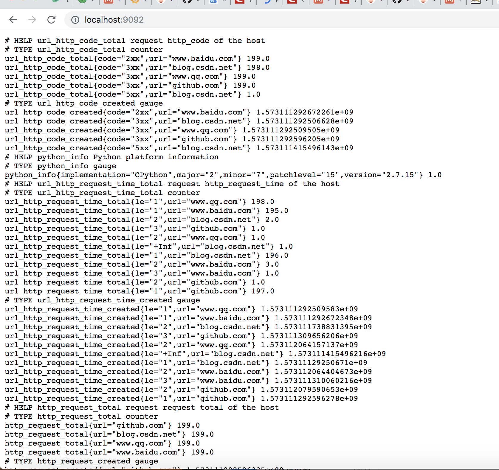
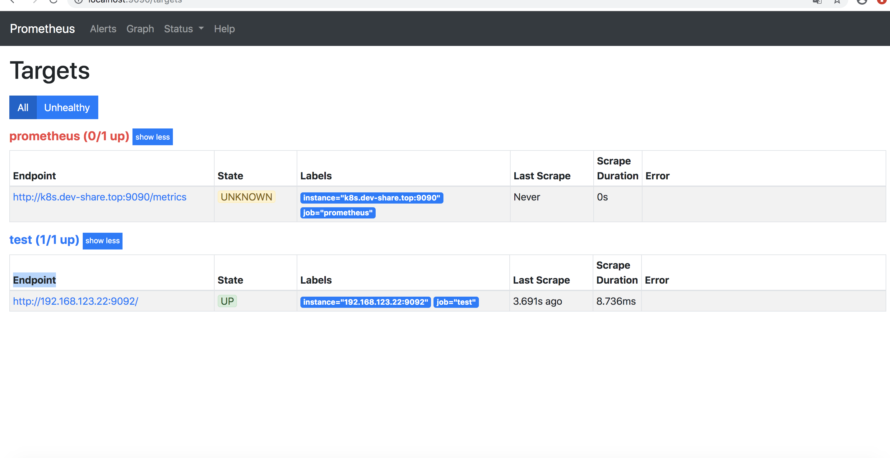
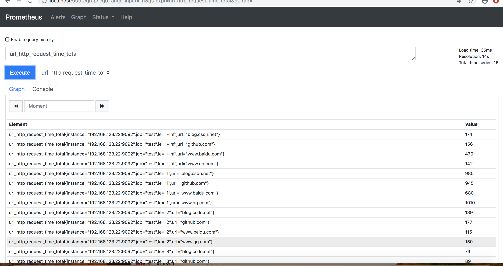

## prometheus四种数据类型   
### 1.Counter

Counter是一个累加指标数据，这个值随着时间只会逐渐的增加，比如程序完成的总任务数量，运行错误发生的总次数。


```python
from prometheus_client import Counter
c = Counter('my_failures', 'Description of counter')
c.inc()     # Increment by 1
c.inc(1.6)  # Increment by given value
```

如果metric名称带有后缀 `_total` 它会被删除，但是counter类型的时序数列， `_total` 后缀会自动加上。这是
用于实现OpenMetrics和Prometheus文本格式之间的兼容性。

### 2.Gauge

代表了采集的一个单一数据，这个数据可以增加也可以减少。

```python
from prometheus_client import Gauge
g = Gauge('my_inprogress_requests', 'Description of gauge')
g.inc()      # Increment by 1
g.dec(10)    # Decrement by given value
g.set(4.2)   # Set to a given value
```

一些通常用法:

```python
g.set_to_current_time()   # Set to current unixtime

# Increment when entered, decrement when exited.
@g.track_inprogress()
def f():
  pass

with g.track_inprogress():
  pass
```

也可以从回调函数取值:

```python
d = Gauge('data_objects', 'Number of objects')
my_dict = {}
d.set_function(lambda: len(my_dict))
```

### 3.Summary

Summary跟踪事件的大小和数量。由`< basename>{quantile="< φ>"}`，`< basename>_sum`，`< basename>_count`组成，主要用于表示一段时间内数据采样结果（通常时请求持续时间或响应大小）

```python
from prometheus_client import Summary
s = Summary('request_latency_seconds', 'Description of summary')
s.observe(4.7)    # Observe 4.7 (seconds in this case)
```

### 4.Histogram

Histogram 由 `< basename>_bucket{le="< upper inclusive bound>"}`，`< basename>_bucket{le="+Inf"}`, `< basename>_sum`，`_count` 组成，主要用于表示一段时间范围内对数据进行采样（通常是请求持续时间或响应大小），并能够对其指定区间以及总数进行统计，通常它采集的数据展示为直方图。使用Histogram和Summary指标的时候同时会产生多组数据，_count代表了采样的总数，_sum则代表采样值的和。 _bucket则代表了落入此范围的数据。

```python
from prometheus_client import Histogram
h = Histogram('request_latency_seconds', 'Description of histogram')
h.observe(4.7)    # Observe 4.7 (seconds in this case)
```    
## 例子   
### example.py   
例子模拟对IP进行监控，检查响应情况，就是循环执行curl IP/xxx.html ，然后查看http code和响应时间
```python
import prometheus_client
from prometheus_client import Gauge,start_http_server,Counter
import pycurl
import time
import threading
from io import BytesIO

url_http_code = Counter("url_http_code", "request http_code of the host",['code','url'])
url_http_request_time = Counter("url_http_request_time", "request http_request_time of the host",['le','url'])
http_request_total = Counter("http_request_total", "request request total of the host",['url'])

def test_website(url):
    buffer_curl = BytesIO()
    c = pycurl.Curl()
    c.setopt(c.URL, url)
    c.setopt(c.WRITEDATA, buffer_curl)
    c.setopt(c.CONNECTTIMEOUT, 3)
    c.setopt(c.TIMEOUT, 3)
    try:
        c.perform()
    except pycurl.error:
        http_code = 500
        http_total_time = 999
    else:
        http_code = c.getinfo(pycurl.HTTP_CODE)
        http_total_time = c.getinfo(pycurl.TOTAL_TIME)
    return http_code,http_total_time

def count_metric(url):
    http_code, http_total_time = test_website(url)
    if http_code >= 100 and http_code < 200 :
        url_http_code.labels('1xx',url).inc()
    elif http_code >= 200 and http_code < 300 :
        url_http_code.labels('2xx',url).inc()
    elif http_code >= 300 and http_code < 400 :
        url_http_code.labels('3xx',url).inc()
    elif http_code >= 400 and http_code < 500 :
        url_http_code.labels('4xx',url).inc()
    else:
        url_http_code.labels('5xx',url).inc()
    if http_total_time < 1 :
        url_http_request_time.labels('1',url).inc()
    elif http_total_time < 2 :
        url_http_request_time.labels('2',url).inc()
    elif http_total_time < 3 :
        url_http_request_time.labels('3',url).inc()
    else :
        url_http_request_time.labels('+Inf',url).inc()
    http_request_total.labels(url).inc()

def count_threads(url):
    while True:
        t = threading.Thread(target=count_metric,args=(url,))
        t.setDaemon(True)
        t.start()
        time.sleep(5)

if __name__ == '__main__':
    start_http_server(9092)
    server_list = [
            'www.baidu.com',
            'www.qq.com',
            'blog.csdn.net',
            'github.com',
            ]
    threads = []
    for url in server_list:
        t = threading.Thread(target=count_threads,args=(url,))
        threads.append(t)
    for thread in threads:
        thread.setDaemon(True)
        thread.start()
    thread.join()
```    

9092端口暴露出来的数据  
   

### prometheus.yml   
需修改例子运行的ip
```
# my global config
global:
  # 设置抓取数据的时间间隔，间隔设置为每15秒一次。默认为每1分钟。
  scrape_interval:     15s
  # 设定抓取数据的超时时间，默认为10s
  scrape_timeout: 15s
  # 设置规则刷新，每15秒刷新一次规则。默认值为每1分钟。
  evaluation_interval: 15s

scrape_configs:
  # 配置上述例子的job，ip是运行例子主机的ip
  - job_name: 'test'
    metrics_path: / 
    static_configs:
      - targets: ['192.168.123.22:9092']
```    
以下命令注意要替换prometheus.yml文件的目录位置
```
docker run -d  -p 9090:9090 -v /Users/tangting/Desktop/prometheus_grafana/test/prometheus.yml:/etc/prometheus/prometheus.yml prom/prometheus
```     
访问prometheus（此处我部署在本机）
```
http://localhost:9090/targets
```   
prometheus界面,成功取到数据    
    

